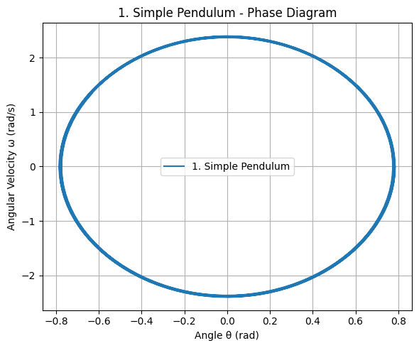

# Problem 2
## Investigating the Dynamics of a Forced Damped Pendulum

### Motivation
The forced damped pendulum exhibits complex dynamics due to the interplay of damping, restoring forces, and external periodic forcing. Understanding this system provides insights into resonance, chaos, and quasiperiodic motion, relevant in fields such as energy harvesting, climate systems, and mechanical vibrations.

### Theoretical Foundation
The equation of motion for a forced damped pendulum is:

$$
\frac{d^2\theta}{dt^2} + \gamma \frac{d\theta}{dt} + \omega_0^2 \sin(\theta) = A \cos(\omega t)
$$

For small angles, we approximate 

$$
 \sin(\theta) \approx \theta 
 $$
 
 , reducing the equation to a linear form:

$$
\frac{d^2\theta}{dt^2} + \gamma \frac{d\theta}{dt} + \omega_0^2 \theta = A \cos(\omega t)
$$

The resonance condition occurs when 

$$
 \omega \approx \omega_0 
 $$
 
 , leading to maximum amplitude.

### Numerical Simulation
We solve the nonlinear equation numerically using the Runge-Kutta method.

```python
import numpy as np
import matplotlib.pyplot as plt
from scipy.integrate import solve_ivp

# Define the forced damped pendulum equations
def forced_damped_pendulum(t, y, gamma, omega0, A, omega):
    theta, omega_t = y
    dtheta_dt = omega_t
    domega_dt = -gamma * omega_t - omega0**2 * np.sin(theta) + A * np.cos(omega * t)
    return [dtheta_dt, domega_dt]

# Parameters
gamma = 0.5   # Damping coefficient
omega0 = 1.0  # Natural frequency
A = 1.2       # Forcing amplitude
omega = 2.0   # Forcing frequency

# Initial conditions and time span
t_span = (0, 50)
y0 = [0.2, 0] # Initial angle and angular velocity
t_eval = np.linspace(0, 50, 1000)

# Solve the ODE
sol = solve_ivp(forced_damped_pendulum, t_span, y0, t_eval=t_eval, args=(gamma, omega0, A, omega))

# Plot results
plt.figure(figsize=(10,5))
plt.plot(sol.t, sol.y[0], label="Theta (angle)")
plt.xlabel("Time")
plt.ylabel("Angle (radians)")
plt.title("Forced Damped Pendulum Motion")
plt.legend()
plt.grid()
plt.show()
```


### Analysis of Dynamics
- **Effects of Parameters:**
  - Increasing 
  
  $$ 
  \gamma 
  $$ 
  
  leads to faster damping.
  - Higher 
  
  $$
   A 
   $$
   
    induces chaotic behavior at certain frequencies.
  - When 
  
  $$
   \omega \approx \omega_0 
   $$
   
   , resonance occurs.
- **Chaos and Transitions:**
  - A phase portrait can illustrate chaotic behavior.
  - Poincaré sections help identify quasiperiodic or chaotic states.

### Practical Applications
- **Energy Harvesting:** Used in piezoelectric devices.
- **Engineering:** Suspension bridges under periodic loads.
- **Biomechanics:** Modeling human gait oscillations.

### Conclusion
This study demonstrates the transition from simple periodic motion to chaos. Future extensions can include nonlinear damping or stochastic driving forces.

# Graphs for 5 States of Pendulum (Python Codes)

```python
import numpy as np
import matplotlib.pyplot as plt
from scipy.integrate import solve_ivp

# Ortak parametreler
g = 9.81     # Yerçekimi
l = 1.0      # Uzunluk
gamma = 0.1  # Sönüm katsayısı
A1 = 0.5     # Zorlayıcı kuvvet (Senaryo 1)
A2 = 1.2     # Zorlayıcı kuvvet (Senaryo 2)
w1 = 2.0     # Frekans 1
w2 = 3.5     # Frekans 2

t_span = (0, 20)
t_eval = np.linspace(*t_span, 1000)
theta0 = [np.pi / 4, 0]  # Başlangıç açısı ve hızı

# Genel çözüm fonksiyonu
def solve_pendulum(func, label):
    sol = solve_ivp(func, t_span, theta0, t_eval=t_eval)
    plt.plot(sol.t, sol.y[0], label=label)

# 1. Simple Pendulum
def simple_pendulum(t, y):
    return [y[1], - (g / l) * np.sin(y[0])]

# 2. Damped Pendulum
def damped_pendulum(t, y):
    return [y[1], -gamma * y[1] - (g / l) * np.sin(y[0])]

# 3. Forced Pendulum
def forced_pendulum(t, y):
    return [y[1], - (g / l) * np.sin(y[0]) + A1 * np.cos(w1 * t)]

# 4. Forced Damped Pendulum - Scenario 1
def forced_damped_1(t, y):
    return [y[1], -gamma * y[1] - (g / l) * np.sin(y[0]) + A1 * np.cos(w1 * t)]

# 5. Forced Damped Pendulum - Scenario 2
def forced_damped_2(t, y):
    return [y[1], -0.05 * y[1] - (g / l) * np.sin(y[0]) + A2 * np.cos(w2 * t)]

# Tüm grafikleri çiz
plt.figure(figsize=(14, 8))
solve_pendulum(simple_pendulum, "1. Simple Pendulum")
solve_pendulum(damped_pendulum, "2. Damped Pendulum")
solve_pendulum(forced_pendulum, "3. Forced Pendulum")
solve_pendulum(forced_damped_1, "4. Forced Damped - Scenario 1")
solve_pendulum(forced_damped_2, "5. Forced Damped - Scenario 2")

plt.title("Pendulum Scenarios")
plt.xlabel("Time (s)")
plt.ylabel("Angle θ (rad)")
plt.legend()
plt.grid(True)
plt.tight_layout()
plt.show()
```


# Phase Diagrams for Pendulum Scenarios (Python Code)

```python
import numpy as np
import matplotlib.pyplot as plt
from scipy.integrate import solve_ivp

# Common parameters
g = 9.81
l = 1.0
gamma = 0.1
A1 = 0.5
A2 = 1.2
w1 = 2.0
w2 = 3.5

t_span = (0, 20)
t_eval = np.linspace(*t_span, 1000)
theta0 = [np.pi / 4, 0]  # initial [theta, omega]

# Phase plot function
def phase_plot(system_func, title):
    sol = solve_ivp(system_func, t_span, theta0, t_eval=t_eval)
    theta = sol.y[0]
    omega = sol.y[1]

    plt.figure(figsize=(6, 5))
    plt.plot(theta, omega, label=title)
    plt.title(title + " - Phase Diagram")
    plt.xlabel("Angle θ (rad)")
    plt.ylabel("Angular Velocity ω (rad/s)")
    plt.grid(True)
    plt.legend()
    plt.tight_layout()
    plt.show()

# 1. Simple Pendulum
def simple_pendulum(t, y):
    return [y[1], - (g / l) * np.sin(y[0])]
phase_plot(simple_pendulum, "1. Simple Pendulum")

# 2. Damped Pendulum
def damped_pendulum(t, y):
    return [y[1], -gamma * y[1] - (g / l) * np.sin(y[0])]
phase_plot(damped_pendulum, "2. Damped Pendulum")

# 3. Forced Pendulum
def forced_pendulum(t, y):
    return [y[1], - (g / l) * np.sin(y[0]) + A1 * np.cos(w1 * t)]
phase_plot(forced_pendulum, "3. Forced Pendulum")

# 4. Forced Damped Pendulum - Scenario 1
def forced_damped_1(t, y):
    return [y[1], -gamma * y[1] - (g / l) * np.sin(y[0]) + A1 * np.cos(w1 * t)]
phase_plot(forced_damped_1, "4. Forced Damped - Scenario 1")

# 5. Forced Damped Pendulum - Scenario 2
def forced_damped_2(t, y):
    return [y[1], -0.05 * y[1] - (g / l) * np.sin(y[0]) + A2 * np.cos(w2 * t)]
phase_plot(forced_damped_2, "5. Forced Damped - Scenario 2")
```




[visit website](https://colab.research.google.com/drive/1Q9YGNhFdYVcKoypTtUA0A64rQVRPXZso?usp=sharing)
