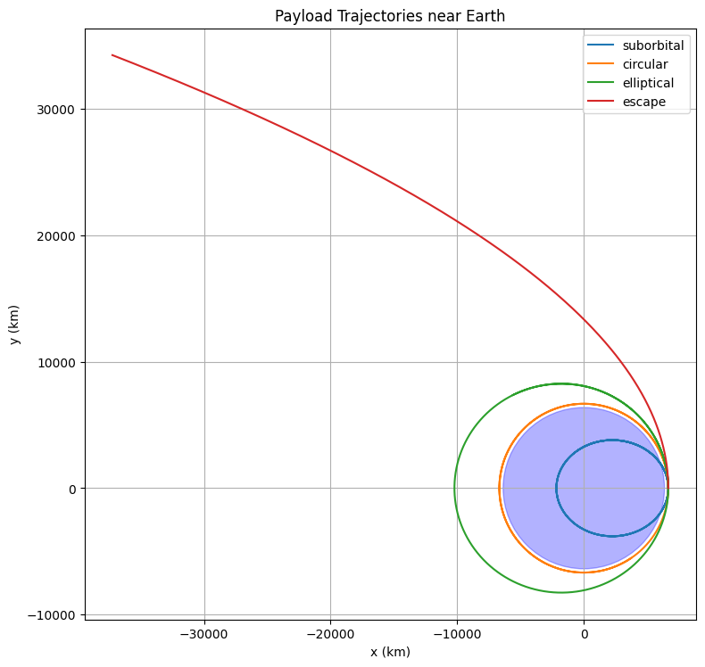
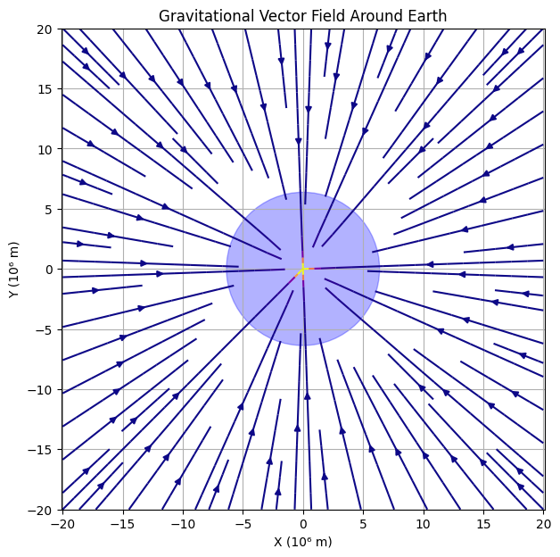

# Problem 3

# # Trajectories of a Freely Released Payload Near Earth

## Motivation
The trajectory of an object released from a moving rocket depends on its initial velocity and the gravitational influence of Earth. By analyzing these trajectories, we can understand orbital insertion, reentry paths, or escape scenarios. This knowledge is essential in space mission planning, satellite deployment, and reentry vehicle design.

---

## Physics Background

### Newton's Law of Gravitation:

$$
F = \frac{GMm}{r^2} \Rightarrow a = \frac{GM}{r^2} 
$$

This acceleration acts towards the center of Earth.

### Types of Trajectories
- **Circular Orbit**: Object moves with constant speed in a circular path.
- **Elliptical Orbit**: Object is bound to Earth but not at a constant distance.
- **Parabolic Escape**: Minimum speed to escape Earth's gravity.
- **Hyperbolic Escape**: Object escapes Earth with excess velocity.
- **Suborbital Trajectory**: Falls back to Earth before completing an orbit.

---

### Initial Conditions and Solver
```python
# Choose an altitude and initial velocity (vary this to simulate different cases)
altitude = 300e3  # 300 km
r0 = R_earth + altitude
v_circular = np.sqrt(mu / r0)  # Circular orbital speed

# Modify initial velocity to simulate different trajectories
initial_conditions = {
    'suborbital': [0, 0.7 * v_circular],
    'circular': [0, v_circular],
    'elliptical': [0, 1.1 * v_circular],
    'escape': [0, np.sqrt(2) * v_circular],
}

fig, ax = plt.subplots(figsize=(8, 8))

for label, vy0 in initial_conditions.items():
    y0 = [r0, 0, 0, vy0]  # x, vx, y, vy
    sol = solve_ivp(equations, [0, 10000], y0, t_eval=np.linspace(0, 10000, 5000))
    x = sol.y[0]
    y = sol.y[2]
    ax.plot(x / 1e3, y / 1e3, label=label)

# Earth
earth = plt.Circle((0, 0), R_earth / 1e3, color='blue', alpha=0.3)
ax.add_patch(earth)

ax.set_xlabel('x (km)')
ax.set_ylabel('y (km)')
ax.set_title('Payload Trajectories near Earth')
ax.set_aspect('equal')
ax.legend()
plt.grid(True)
plt.tight_layout()
plt.show()
```



---

## Applications in Space Missions
- **Orbital Insertion**: Matching circular or elliptical orbits for satellites.
- **Escape Trajectory**: Interplanetary missions (e.g., to Mars).
- **Reentry Design**: Predicting where a returning capsule will land.

---

## Conclusion
By changing the initial velocity of a payload, we observe distinct paths that help classify motion near Earth. Simulating these paths enhances our understanding of celestial mechanics and supports mission-critical decisions in aerospace engineering.

```python
radii = np.linspace(R_earth, R_earth + 2e6, 500)
v_orbit = np.sqrt(mu / radii) / 1e3      # km/s
v_escape = np.sqrt(2 * mu / radii) / 1e3 # km/s

plt.figure(figsize=(8, 5))
plt.plot((radii - R_earth) / 1e3, v_orbit, label='Orbital Velocity')
plt.plot((radii - R_earth) / 1e3, v_escape, label='Escape Velocity')
plt.xlabel('Altitude (km)')
plt.ylabel('Velocity (km/s)')
plt.title('Velocity vs Altitude Near Earth')
plt.legend()
plt.grid(True)
plt.tight_layout()
plt.show()
```


```python
x = np.linspace(-2e7, 2e7, 40)
y = np.linspace(-2e7, 2e7, 40)
X, Y = np.meshgrid(x, y)
R = np.sqrt(X**2 + Y**2)
ax = -mu * X / R**3
ay = -mu * Y / R**3

plt.figure(figsize=(7, 7))
plt.streamplot(X/1e6, Y/1e6, ax, ay, color=np.sqrt(ax**2 + ay**2), cmap='plasma')
earth = plt.Circle((0, 0), R_earth / 1e6, color='blue', alpha=0.3)
plt.gca().add_patch(earth)
plt.xlabel('X (10⁶ m)')
plt.ylabel('Y (10⁶ m)')
plt.title('Gravitational Vector Field Around Earth')
plt.grid(True)
plt.axis('equal')
plt.show()
```




[visit website](https://colab.research.google.com/drive/1sndCMzPXDamm9P4kyI4kwXrh5LwAy25c?usp=sharing)