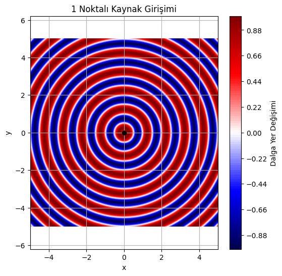
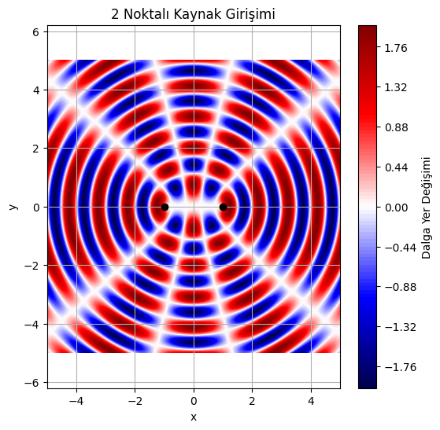
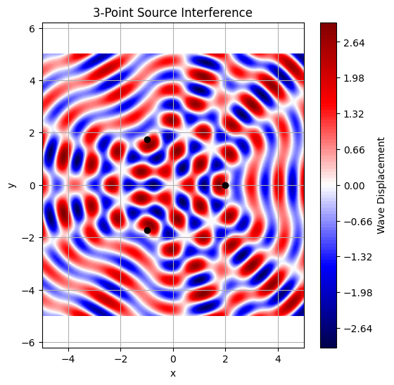
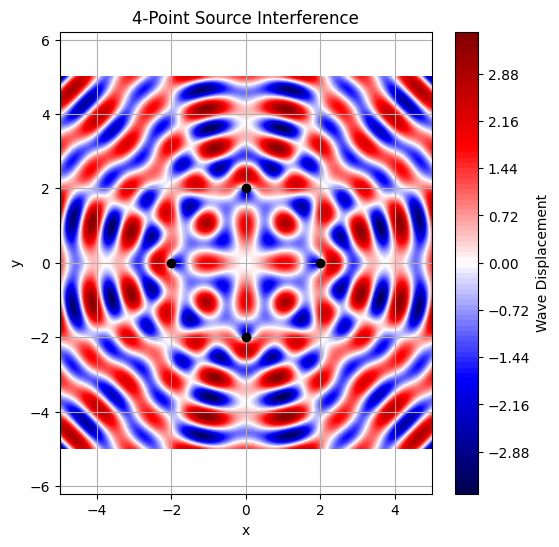
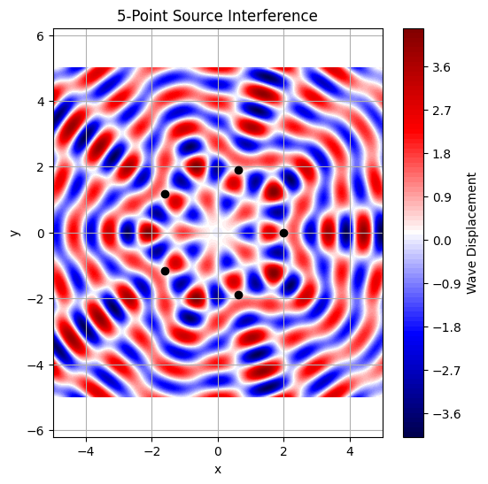
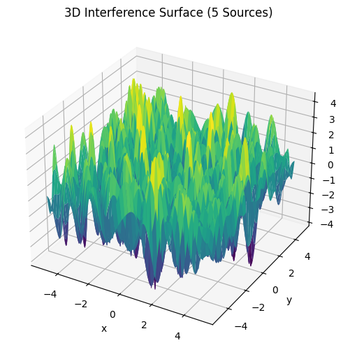

# Problem 1

# # Interference Patterns on a Water Surface

## Motivation
Interference on a water surface provides a beautiful, tangible example of how waves interact. By studying these patterns from coherent point sources arranged in a regular polygon, we can observe and analyze wave superposition, constructive interference (bright spots), and destructive interference (dark spots).

---

## Assumptions and Parameters
- All sources emit circular waves.
- Same amplitude 

$$
 A 
 $$
 
 , wavelength 
 
 $$
  \lambda 
  $$
  
  , and frequency 
  
  $$
   f 
   $$
   .
- The phase is constant across all sources.

---

## Imports and Configuration
```python
import numpy as np
import matplotlib.pyplot as plt
```

---

## Observations
- **Constructive Interference**: Regions where waves add (bright colors).
- **Destructive Interference**: Regions where waves cancel (dark colors).
- **Symmetry**: The pattern reflects the symmetry of the polygon.

Try changing `N` to 3 (triangle), 4 (square), or more to explore different polygon arrangements.

---

## Conclusion
This simulation shows how coherent sources produce rich interference patterns. The configuration of the sources determines the spatial frequency and symmetry of the interference. Such analyses are useful in acoustics, optics, and wave physics in general.

```python
import numpy as np
import matplotlib.pyplot as plt

# Dalga parametreleri
A = 1.0
wavelength = 1.0
k = 2 * np.pi / wavelength
omega = 2 * np.pi
phi = 0
t = 0.0

# Grid tanımı
x = np.linspace(-5, 5, 500)
y = np.linspace(-5, 5, 500)
X, Y = np.meshgrid(x, y)

# Kaynakların yer alacağı dairenin yarıçapı
radius = 2.0

# Kaynakları üret
def generate_sources(N):
    if N == 1:
        return [(0, 0)]  # Tek kaynak merkezde
    elif N == 2:
        return [(-radius / 2, 0), (radius / 2, 0)]  # İki kaynak yatay eksende
    else:
        raise ValueError("Bu sürüm sadece N=1 ve N=2 içindir.")

# Girişim desenini çiz
def plot_pattern(N):
    sources = generate_sources(N)
    Z = np.zeros_like(X)
    for sx, sy in sources:
        r = np.sqrt((X - sx)**2 + (Y - sy)**2)
        Z += A * np.sin(k * r - omega * t + phi)

    plt.figure(figsize=(6, 6))
    plt.contourf(X, Y, Z, levels=100, cmap='seismic')

    # Kaynakları siyah noktalarla çiz
    for sx, sy in sources:
        plt.plot(sx, sy, 'ko')

    plt.title(f'{N} Noktalı Kaynak Girişimi')
    plt.xlabel('x')
    plt.ylabel('y')
    plt.axis('equal')
    plt.colorbar(label='Dalga Yer Değişimi')
    plt.grid(True)
    plt.show()

# Yalnızca N = 1 ve N = 2 durumları için çizim
for N in [1, 2]:
    plot_pattern(N)
```





```python
import numpy as np
import matplotlib.pyplot as plt

# Parameters
A = 1.0
wavelength = 1.0
k = 2 * np.pi / wavelength
omega = 2 * np.pi
phi = 0
t = 0.0
x = np.linspace(-5, 5, 500)
y = np.linspace(-5, 5, 500)
X, Y = np.meshgrid(x, y)
radius = 2.0

def generate_polygon_sources(N, radius):
    angles = np.linspace(0, 2 * np.pi, N, endpoint=False)
    return [(radius * np.cos(a), radius * np.sin(a)) for a in angles]

def plot_pattern(N):
    sources = generate_polygon_sources(N, radius)
    Z = np.zeros_like(X)
    for sx, sy in sources:
        r = np.sqrt((X - sx)**2 + (Y - sy)**2)
        Z += A * np.sin(k * r - omega * t + phi)
    plt.figure(figsize=(6, 6))
    plt.contourf(X, Y, Z, levels=100, cmap='seismic')
    for sx, sy in sources:
        plt.plot(sx, sy, 'ko')
    plt.title(f'{N}-Point Source Interference')
    plt.xlabel('x')
    plt.ylabel('y')
    plt.axis('equal')
    plt.colorbar(label='Wave Displacement')
    plt.grid(True)
    plt.show()

# Triangle, Square, Pentagon
for N in [3, 4, 5]:
    plot_pattern(N)
```






```python
from mpl_toolkits.mplot3d import Axes3D

def plot_3d_surface(N):
    sources = generate_polygon_sources(N, radius)
    Z = np.zeros_like(X)
    for sx, sy in sources:
        r = np.sqrt((X - sx)**2 + (Y - sy)**2)
        Z += A * np.sin(k * r - omega * t + phi)
    fig = plt.figure(figsize=(10, 6))
    ax = fig.add_subplot(111, projection='3d')
    ax.plot_surface(X, Y, Z, cmap='viridis', edgecolor='none')
    ax.set_title(f'3D Interference Surface ({N} Sources)')
    ax.set_xlabel('x')
    ax.set_ylabel('y')
    ax.set_zlabel('Amplitude')
    plt.show()

# Show 3D pattern for pentagon
plot_3d_surface(5)
```



[visit website](https://colab.research.google.com/drive/1uLgyrHDDlL2_l9w8PafNX0HCOFjBmVYL?usp=sharing)