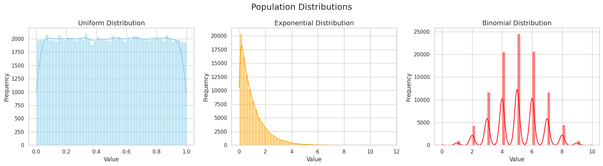
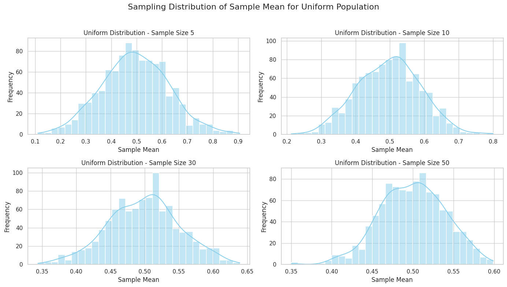
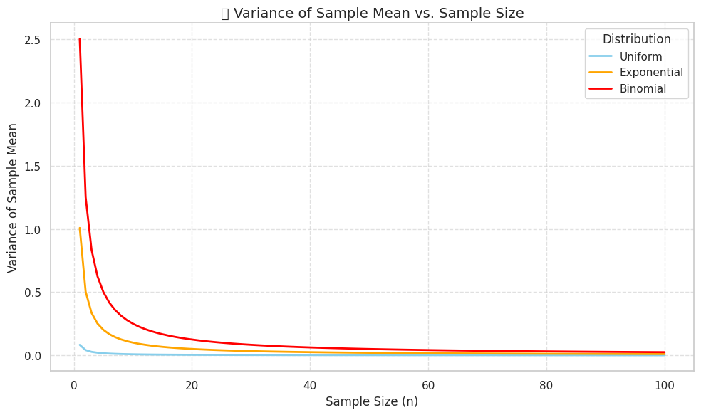
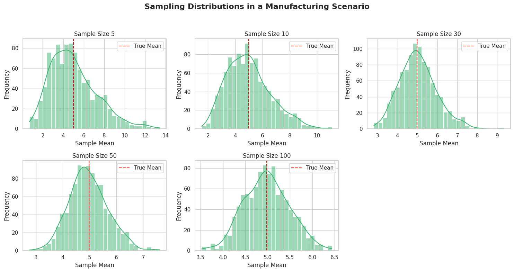
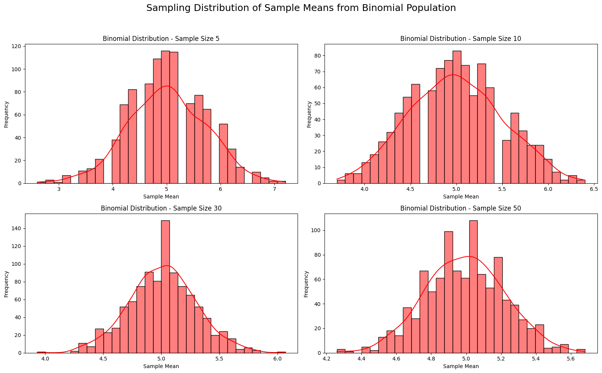

# Problem 1

# 📘 Exploring the Central Limit Theorem through Simulations


## 🎯 Motivation

The **Central Limit Theorem (CLT)** is a fundamental theorem in probability and statistics. It states that the distribution of the sample mean approaches a **normal distribution** as the sample size increases, regardless of the shape of the original population distribution.

This simulation project allows us to visually and computationally explore the CLT in action by drawing samples from different distributions and analyzing their sample means.

```python
def sample_means(population, sample_size, num_samples=1000):
    means = [np.mean(np.random.choice(population, size=sample_size, replace=False)) for _ in range(num_samples)]
    return means
```
```python
np.random.choice(population, size=sample_size, replace=False)
```
---

## 🧰 Tools & Libraries

We will use the following Python libraries:

- `numpy` for numerical computations
- `matplotlib` and `seaborn` for visualization
- `matplotlib.animation` for GIF generation

---

## 🔢 1. Generating Population Distributions

We simulate large populations from:
- **Uniform Distribution**: Equal probability over a range
- **Exponential Distribution**: Skewed distribution
- **Binomial Distribution**: Discrete distribution

```python
fig, axs = plt.subplots(1, 3, figsize=(18, 5))
distributions = [
    ("Uniform", uniform_pop, "skyblue"),
    ("Exponential", exponential_pop, "orange"),
    ("Binomial", binomial_pop, "red")
]

for ax, (title, data, color) in zip(axs, distributions):
    sns.histplot(data, bins=50, kde=True, color=color, ax=ax)
    ax.set_title(f"{title} Distribution", fontsize=14)
    ax.set_xlabel("Value")
    ax.set_ylabel("Frequency")

fig.suptitle("Population Distributions", fontsize=18)
plt.tight_layout()
plt.show()
```


---

## 🔄 2. Sampling and Visualization

We repeatedly sample from each population, compute the sample means, and visualize the resulting sampling distribution for increasing sample sizes (5, 10, 30, 50). This allows us to observe how the distribution of the mean converges to normality.

```python
plt.title(f"{dist_name} — Sample Size {sample_size}", fontsize=12)
plt.xlabel("Sample Mean")
plt.ylabel("Frequency")
```

```python
sample_sizes = [5, 10, 30, 50]
distributions = {
    'Uniform': pop_uniform,
    'Exponential': pop_exponential,
    'Binomial': pop_binomial
}

for name, pop in distributions.items():
    plt.figure(figsize=(14, 8))
    for i, size in enumerate(sample_sizes):
        means = sample_means(pop, size)
        plt.subplot(2, 2, i+1)
        sns.histplot(means, kde=True, bins=30, color="skyblue")
        plt.title(f"{name} Distribution - Sample Size {size}")
        plt.xlabel("Sample Mean")
        plt.ylabel("Frequency")
    plt.suptitle(f"Sampling Distribution of Sample Mean for {name} Population", fontsize=16)
    plt.tight_layout(rect=[0, 0, 1, 0.96])
    plt.savefig(f"{name}_CLT_Plot.png")  # Save as picture
    plt.show()
```


---

## 🔬 3. Parameter Exploration

We also explore how sample size affects:
- The shape of the sampling distribution
- The variance (spread) of the sample means

## 🔬 Parameter Exploration – Variance vs. Sample Size

### 📘 Objective

This section explores how increasing the **sample size (n)** affects the **variance of the sample mean** for different population distributions. According to the **Central Limit Theorem (CLT)**:

> As the sample size increases, the **distribution of the sample mean becomes more concentrated** around the population mean, and the **variance of the sample mean decreases**.

---

### 📐 Mathematical Insight

The **variance of the sample mean** is given by the formula:

$$
\mathrm{Var}(\bar{X}) = \frac{\sigma^2}{n}
$$

Where:
- $
\sigma^2
$ is the population variance
- $
n
$ is the sample size
- $
\bar{X}
$ is the sample mean

This means that increasing the sample size **reduces the spread** of the sample mean distribution, making our estimates more **precise**.

---

### 📊 Visualization

We use the following population distributions:
- **Uniform Distribution**: Equal probability between 0 and 1
- **Exponential Distribution**: Right-skewed, models time between events
- **Binomial Distribution**: Discrete, counts number of successes in Bernoulli trials

We compute and plot the **variance of the sample mean** for each distribution across sample sizes from 1 to 100.

---

### 🔍 Expected Outcome

- All curves should **decrease asymptotically**, confirming the $
\frac{1}{n}
$
 relationship.
- Even for **skewed or discrete** distributions, the behavior remains consistent.
- This demonstrates that the **CLT applies universally** as long as the sample size is sufficiently large.

---

### ✅ Key Takeaways

- **Larger samples** lead to **more stable estimates** of the population mean.
- The sample mean becomes **less variable** as $
n
$ increases.
- This phenomenon is **distribution-independent**, further validating the CLT.

---


```python
import numpy as np
import matplotlib.pyplot as plt

# Set seed and generate populations
np.random.seed(42)
N = 100_000

uniform_pop = np.random.uniform(0, 1, N)
exponential_pop = np.random.exponential(scale=1.0, size=N)
binomial_pop = np.random.binomial(n=10, p=0.5, size=N)

# Sample sizes to explore
sample_sizes = np.arange(1, 101)

# Calculate population variances
var_uniform = np.var(uniform_pop)
var_exponential = np.var(exponential_pop)
var_binomial = np.var(binomial_pop)

# Calculate theoretical sample mean variances
sample_var_uniform = var_uniform / sample_sizes
sample_var_exponential = var_exponential / sample_sizes
sample_var_binomial = var_binomial / sample_sizes

# Plotting
plt.figure(figsize=(10, 6))
plt.plot(sample_sizes, sample_var_uniform, label="Uniform", color="skyblue", lw=2)
plt.plot(sample_sizes, sample_var_exponential, label="Exponential", color="orange", lw=2)
plt.plot(sample_sizes, sample_var_binomial, label="Binomial", color="red", lw=2)

plt.title("📉 Variance of Sample Mean vs. Sample Size", fontsize=14)
plt.xlabel("Sample Size (n)", fontsize=12)
plt.ylabel("Variance of Sample Mean", fontsize=12)
plt.grid(True, linestyle='--', alpha=0.6)
plt.legend(title="Distribution")
plt.tight_layout()
plt.show()
```



---

## 🏭 4. Practical Applications of the Central Limit Theorem

The Central Limit Theorem (CLT) is not just a theoretical concept—it powers many statistical applications in real life.

Here are a few key areas:

| Field           | Application Example                        |
|----------------|---------------------------------------------|
| 🎯 Polling      | Estimating election results from small surveys |
| 🏭 Manufacturing | Quality control using average measurements  |
| 💊 Medicine      | Comparing drug effectiveness in clinical trials |
| 💻 Tech          | A/B testing website performance             |
| 📈 Finance       | Predicting average returns on investments   |

In all these cases, the CLT ensures that even if the underlying data is not normally distributed, the sample mean can be treated as approximately normal for inference and decision-making—especially with large enough samples.

Let’s simulate how sampling enables accurate average estimation in a production-quality context.

```python
import numpy as np
import matplotlib.pyplot as plt
import seaborn as sns

# Simulate a population (e.g., machine measurements in a factory)
np.random.seed(42)
true_pop = np.random.exponential(scale=5.0, size=100_000)

# Simulate 1000 samples of different sizes
sample_sizes = [5, 10, 30, 50, 100]
mean_estimates = {}

for n in sample_sizes:
    sample_means = [np.mean(np.random.choice(true_pop, size=n, replace=False)) for _ in range(1000)]
    mean_estimates[n] = sample_means

# Plotting sampling distributions
plt.figure(figsize=(15, 8))
for i, n in enumerate(sample_sizes):
    plt.subplot(2, 3, i+1)
    sns.histplot(mean_estimates[n], bins=30, kde=True, color='mediumseagreen')
    plt.title(f"Sample Size {n}")
    plt.xlabel("Sample Mean")
    plt.ylabel("Frequency")
    plt.axvline(np.mean(true_pop), color='red', linestyle='--', label='True Mean')
    plt.legend()

plt.suptitle("Sampling Distributions in a Manufacturing Scenario", fontsize=16, weight='bold')
plt.tight_layout(rect=[0, 0, 1, 0.95])
plt.show()
```



```python
# Function to generate sample means for various sample sizes
def generate_sample_means(population, sample_sizes, num_samples=1000):
    results = {}
    for n in sample_sizes:
        results[n] = sample_means(population, n, num_samples)
    return results
```

```python
import numpy as np
import matplotlib.pyplot as plt
import seaborn as sns

# Set random seed for reproducibility
np.random.seed(42)

# Generate a large binomial population
N = 100_000
n_trials = 10  # number of trials per binomial experiment
p_success = 0.5  # probability of success
binomial_pop = np.random.binomial(n=n_trials, p=p_success, size=N)

# Function to generate sample means
def sample_means(population, sample_size, num_samples=1000):
    means = [np.mean(np.random.choice(population, size=sample_size, replace=False)) for _ in range(num_samples)]
    return means

# Sample sizes to explore
sample_sizes = [5, 10, 30, 50]

# Plot sampling distributions of the sample mean for each sample size
plt.figure(figsize=(16, 10))

for i, size in enumerate(sample_sizes, 1):
    means = sample_means(binomial_pop, size)
    plt.subplot(2, 2, i)
    sns.histplot(means, bins=30, kde=True, color="red")
    plt.title(f"Binomial Distribution - Sample Size {size}")
    plt.xlabel("Sample Mean")
    plt.ylabel("Frequency")

plt.suptitle("Sampling Distribution of Sample Means from Binomial Population", fontsize=18)
plt.tight_layout(rect=[0, 0, 1, 0.95])
plt.show()
```



---

## ✅ Summary

| Distribution | Skewness | Convergence Speed |
|--------------|----------|-------------------|
| Uniform      | None     | Fast              |
| Exponential  | High     | Moderate          |
| Binomial     | Low      | Fast              |

---

## 💾 Deliverables

- Python scripts for simulations
- Plots for sampling distributions
- Animated GIFs
- Markdown and notebook documentation


[visit web](https://colab.research.google.com/drive/1FCiVyj3Sk7q_5lIThnXdi-JJ-WPDeHiV?usp=sharing)