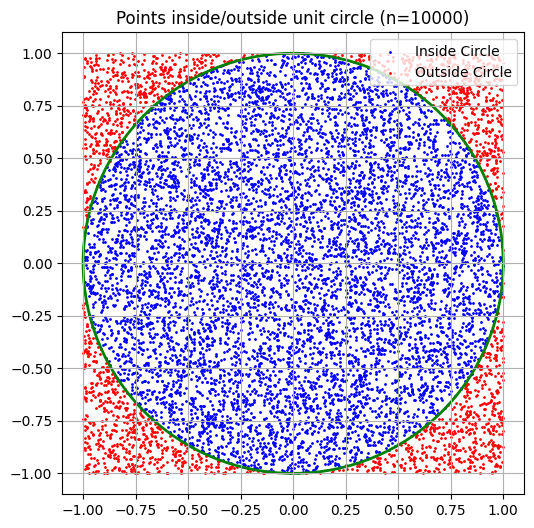
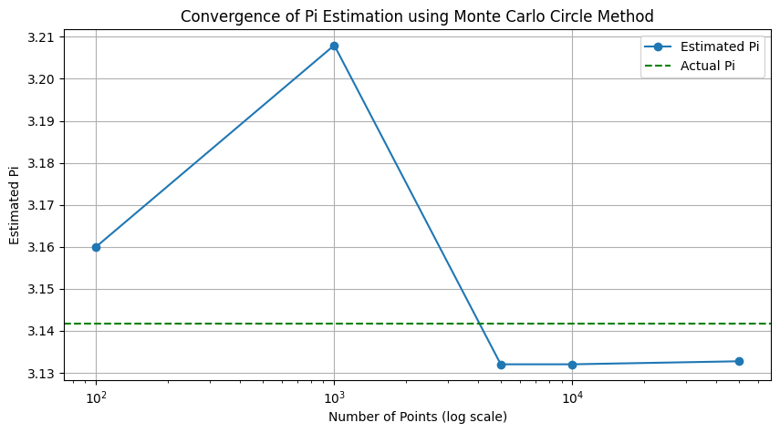
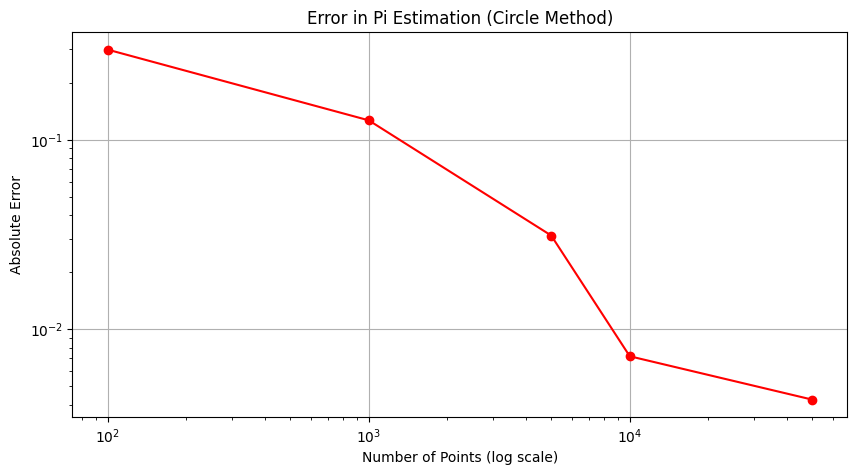
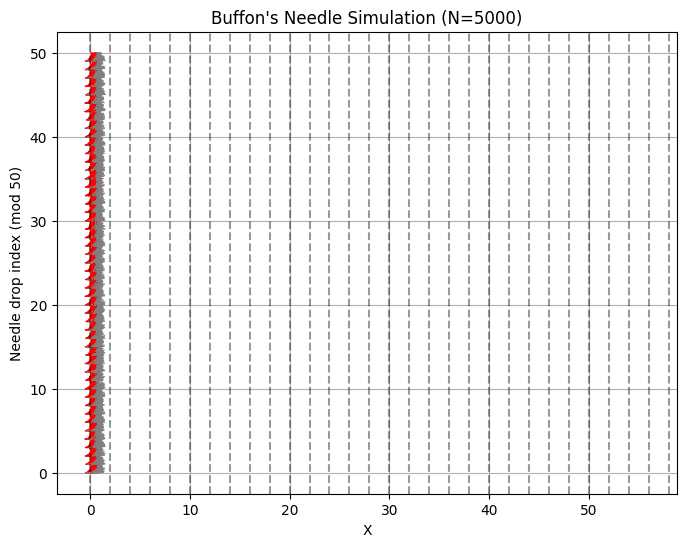
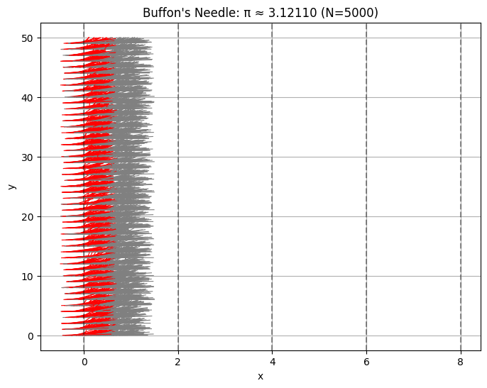
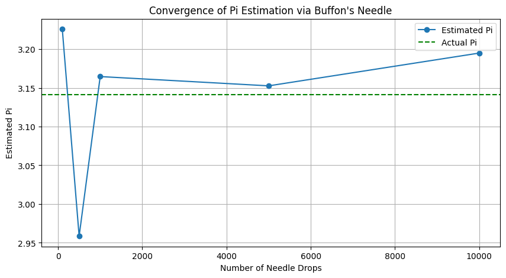

# Problem 2: Estimating π Using Monte Carlo Methods

---

## 🎯 Motivation

Monte Carlo methods use **random sampling** to solve complex problems and estimate numerical values. One of their classic applications is estimating the value of π (pi) via geometric probability. In this assignment, you will explore two different Monte Carlo approaches to estimate π:

- **Part 1:** Using random points inside a square and an inscribed circle.
- **Part 2:** Using Buffon’s Needle experiment, a classic geometric probability problem.

These methods illustrate how randomness can yield elegant solutions to deterministic mathematical constants.

---

## 🟠 Part 1: Estimating π Using a Circle

### 1. Theoretical Background

Consider a unit circle (radius $ r = 1 $) inscribed inside a square with side length 2. The area of the square is:

$$
A_{\text{square}} = 2^2 = 4
$$

The area of the circle is:

$$
A_{\text{circle}} = \pi r^2 = \pi \times 1^2 = \pi
$$

The probability $ P $ that a random point inside the square falls within the circle is the ratio of their areas:

$$
P = \frac{A_{\text{circle}}}{A_{\text{square}}} = \frac{\pi}{4}
$$

Rearranging, π can be estimated as:

$$
\pi \approx 4 \times \frac{\text{Number of points inside the circle}}{\text{Total number of points}}
$$


---

### 2. Simulation Algorithm

1. Generate $ N $ random points $(x, y)$ uniformly distributed inside the square $[-1, 1] \times [-1, 1]$.
2. For each point, check if it lies inside the circle using:

$$
x^2 + y^2 \leq 1
$$

3. Count how many points satisfy this condition.
4. Calculate π estimate using the formula above.


---

### 3. Visualization

- Plot all points:
  - Points inside the circle in **blue**.
  - Points outside the circle in **red**.
- Draw the boundary of the unit circle.
- Display the estimated π value in the plot title.


---

### 4. Convergence Analysis

- Repeat the experiment for different $ N $ values, e.g., 100, 1,000, 10,000, 100,000.
- Plot estimated π values against $ N $ on a log scale.
- Plot the absolute error $ |\pi - \hat{\pi}| $ versus $ N $.


---

## 🧵 Part 2: Estimating π Using Buffon’s Needle

### 1. Theoretical Background

Buffon's Needle is a classical probability experiment:

- A needle of length $ L $ is dropped onto a floor with parallel lines spaced $ D $ units apart, where $ L \leq D $.
- The probability $ P $ that the needle crosses one of the lines is:

$$
P = \frac{2L}{\pi D}
$$

If we drop the needle $ N $ times and observe $ H $ hits (crossings), π can be estimated as:

$$
\pi \approx \frac{2 L N}{D H}
$$

---

### 2. Simulation Algorithm

1. For each drop:
   - Randomly generate the center position of the needle between two lines.
   - Randomly generate the angle \( \theta \in [0, \pi] \) of the needle with respect to the parallel lines.
2. Determine whether the needle crosses a line based on its position and angle.
3. Count the number of hits \( H \).
4. Calculate the π estimate.

---

### 3. Visualization

- Draw the parallel lines horizontally.
- Plot each needle:
  - Needles crossing a line in **red**.
  - Needles not crossing in **gray**.
- Show the estimated π value on the plot.

---

### 4. Convergence Analysis

- Run simulations for varying $ N $ (e.g., 100, 500, 1,000, 5,000, 10,000).
- Plot the estimated π versus $ N $.
- Analyze and discuss the variance and convergence speed compared to the circle method.

---

## ⚖️ Comparison and Discussion

| Method           | Convergence Speed | Accuracy  | Complexity | Visualization Clarity |
|------------------|-------------------|-----------|------------|----------------------|
| Circle-based     | Fast              | High      | Simple     | High                 |
| Buffon’s Needle  | Slower            | Moderate  | Moderate   | Moderate             |

- The **circle method** converges faster and is easier to implement and visualize.
- **Buffon’s Needle** is mathematically elegant and historically significant, but converges slower and has more variance.

---

## ✅ Deliverables

- Python code implementing both methods.
- Plots showing:
  - Points and needles visualizations.
  - Convergence graphs for different sample sizes.
- Comparative analysis and discussion of results.

---

## 📚 References

- [Monte Carlo Method - Wikipedia](https://en.wikipedia.org/wiki/Monte_Carlo_method)  
- [Buffon’s Needle Problem - Wikipedia](https://en.wikipedia.org/wiki/Buffon%27s_needle)  
- Allen B. Downey, *Think Stats*

---

# Appendix: Python Code Examples

```python
import numpy as np
import matplotlib.pyplot as plt
```
# Part 1: Circle Method

```python
import numpy as np
import matplotlib.pyplot as plt

def plot_points_circle(num_points):
    x = np.random.uniform(-1, 1, num_points)
    y = np.random.uniform(-1, 1, num_points)
    
    inside = x**2 + y**2 <= 1
    
    plt.figure(figsize=(6,6))
    plt.scatter(x[inside], y[inside], color='blue', s=1, label='Inside Circle')
    plt.scatter(x[~inside], y[~inside], color='red', s=1, label='Outside Circle')
    circle = plt.Circle((0,0), 1, fill=False, color='green', linewidth=2)
    plt.gca().add_artist(circle)
    plt.gca().set_aspect('equal')
    plt.title(f"Points inside/outside unit circle (n={num_points})")
    plt.legend()
    plt.grid(True)
    plt.show()

# Kullanım:
plot_points_circle(10000)
```



```python
def plot_pi_convergence_circle(sample_sizes):
    estimates = []
    for n in sample_sizes:
        x = np.random.uniform(-1, 1, n)
        y = np.random.uniform(-1, 1, n)
        inside = x**2 + y**2 <= 1
        pi_estimate = 4 * np.sum(inside) / n
        estimates.append(pi_estimate)
    
    plt.figure(figsize=(10,5))
    plt.plot(sample_sizes, estimates, marker='o', linestyle='-', label='Estimated Pi')
    plt.axhline(np.pi, color='green', linestyle='--', label='Actual Pi')
    plt.xscale('log')
    plt.xlabel('Number of Points (log scale)')
    plt.ylabel('Estimated Pi')
    plt.title('Convergence of Pi Estimation using Monte Carlo Circle Method')
    plt.legend()
    plt.grid(True)
    plt.show()

# Kullanım:
sample_sizes = [100, 1000, 5000, 10000, 50000]
plot_pi_convergence_circle(sample_sizes)
```



```python
def plot_pi_error_circle(sample_sizes):
    errors = []
    for n in sample_sizes:
        x = np.random.uniform(-1, 1, n)
        y = np.random.uniform(-1, 1, n)
        inside = x**2 + y**2 <= 1
        pi_estimate = 4 * np.sum(inside) / n
        error = abs(np.pi - pi_estimate)
        errors.append(error)
    
    plt.figure(figsize=(10,5))
    plt.plot(sample_sizes, errors, marker='o', color='red')
    plt.xscale('log')
    plt.yscale('log')
    plt.xlabel('Number of Points (log scale)')
    plt.ylabel('Absolute Error')
    plt.title('Error in Pi Estimation (Circle Method)')
    plt.grid(True)
    plt.show()

# Kullanım:
plot_pi_error_circle(sample_sizes)
```



# Part 2: Buffon's Needle
```python
def plot_buffon_needle(N, L=1.0, D=2.0):
    x_centers = np.random.uniform(0, D/2, N)
    angles = np.random.uniform(0, np.pi/2, N)
    crosses = x_centers <= (L/2) * np.sin(angles)
    
    plt.figure(figsize=(8,6))
    for i in range(N):
        x = x_centers[i]
        theta = angles[i]
        x0 = x - (L/2)*np.cos(theta)
        x1 = x + (L/2)*np.cos(theta)
        y0 = i % 50
        y1 = y0 + L * np.sin(theta)
        color = 'red' if crosses[i] else 'gray'
        plt.plot([x0, x1], [y0, y1], color=color, linewidth=0.8)
    
    for line_pos in np.arange(0, 60, D):
        plt.axvline(line_pos, color='black', linestyle='--', alpha=0.4)
    
    plt.title(f"Buffon's Needle Simulation (N={N})")
    plt.xlabel('X')
    plt.ylabel('Needle drop index (mod 50)')
    plt.grid(True)
    plt.show()

# Kullanım:
plot_buffon_needle(5000)
```


```python
def buffon_needle_simulation(N, L=1.0, D=2.0):
    hits = 0
    x_centers = np.random.uniform(0, D/2, N)
    angles = np.random.uniform(0, np.pi/2, N)

    for i in range(N):
        if x_centers[i] <= (L / 2) * np.sin(angles[i]):
            hits += 1

    if hits == 0:
        return None  # Avoid division by zero

    pi_estimate = (2 * L * N) / (D * hits)

    # Visualization
    plt.figure(figsize=(8, 6))
    for i in range(N):
        x = x_centers[i]
        theta = angles[i]
        x0 = x - (L/2) * np.cos(theta)
        x1 = x + (L/2) * np.cos(theta)
        y0 = i % 50
        y1 = y0 + np.sin(theta) * L
        color = 'red' if x <= (L / 2) * np.sin(theta) else 'gray'
        plt.plot([x0, x1], [y0, y1], color=color, linewidth=0.8)

    for line in np.arange(0, 10, D):
        plt.axvline(line, color='black', linestyle='--', alpha=0.4)

    plt.title(f"Buffon's Needle: π ≈ {pi_estimate:.5f} (N={N})")
    plt.xlabel("x")
    plt.ylabel("y")
    plt.grid(True)
    plt.show()

    return pi_estimate

# Example Usage:
estimate_pi_circle(10000)
buffon_needle_simulation(5000)
```



```python
def plot_pi_convergence_buffon(sample_sizes, L=1.0, D=2.0):
    estimates = []
    for N in sample_sizes:
        x_centers = np.random.uniform(0, D/2, N)
        angles = np.random.uniform(0, np.pi/2, N)
        crosses = x_centers <= (L/2) * np.sin(angles)
        hits = np.sum(crosses)
        if hits == 0:
            pi_estimate = np.nan
        else:
            pi_estimate = (2 * L * N) / (D * hits)
        estimates.append(pi_estimate)
    
    plt.figure(figsize=(10,5))
    plt.plot(sample_sizes, estimates, marker='o', linestyle='-', label='Estimated Pi')
    plt.axhline(np.pi, color='green', linestyle='--', label='Actual Pi')
    plt.xlabel('Number of Needle Drops')
    plt.ylabel('Estimated Pi')
    plt.title("Convergence of Pi Estimation via Buffon's Needle")
    plt.legend()
    plt.grid(True)
    plt.show()

# Kullanım:
sample_sizes_needle = [100, 500, 1000, 5000, 10000]
plot_pi_convergence_buffon(sample_sizes_needle)
```


[visit web](https://colab.research.google.com/drive/19V3WtC19b258Bnnpy-amlo8_d3M3FIYf?usp=sharing)

