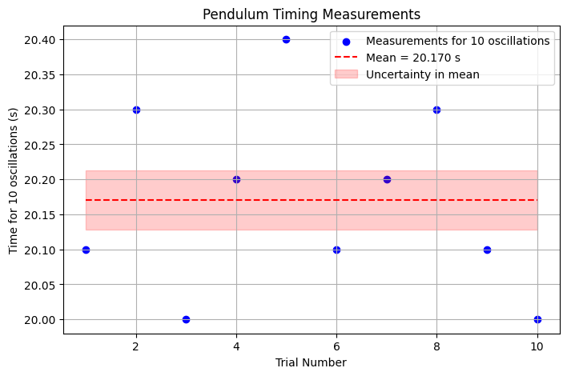
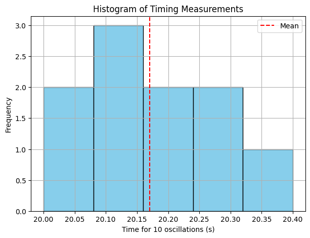
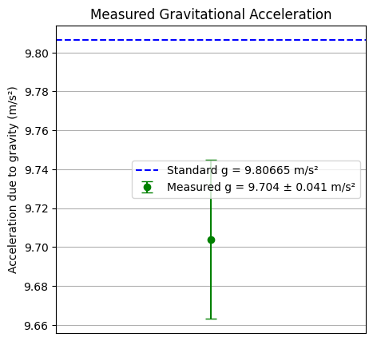

# Problem 1

# Measuring Earth's Gravitational Acceleration Using a Pendulum

---

## 1. Motivation

The acceleration due to gravity, 
 
 $$
 g 
 $$
 
 , is a fundamental physical constant that affects many natural phenomena and engineering applications. A classic, accessible way to measure 
 
 $$
  g 
  $$
  
   is by timing the oscillations of a simple pendulum. This experiment also offers a practical exercise in measurement uncertainty and data analysis.

---

## 2. Materials

- A string (length ~1 or 1.5 meters)
- Small weight (e.g., keychain, bag of coins)
- Stopwatch or smartphone timer
- Ruler or measuring tape

---

## 3. Experimental Setup

- Attach the weight securely to one end of the string.
- Fix the other end of the string to a sturdy support so the pendulum can swing freely.
- Measure the length of the pendulum 

$$
 L 
 $$
 
  from the suspension point to the center of the mass.
- Note the resolution of the measuring tool (e.g., 1 mm for a ruler). The uncertainty in 

$$
 L 
 $$
 
  is half the resolution:

$$
u_L = \frac{\text{resolution}}{2}
$$

---

## 4. Data Collection

- Displace the pendulum by a small angle (< 15°) to ensure simple harmonic motion.
- Release and use the stopwatch to measure the time for **10 full oscillations**.
- Repeat this measurement 10 times and record the values 

$$
 T_{10,i} 
 $$.

---

## 5. Data Processing

### 5.1 Calculate Mean and Uncertainty of the Time for 10 Oscillations

- Mean time for 10 oscillations:

$$
\bar{T}_{10} = \frac{1}{n} \sum_{i=1}^n T_{10,i}
$$

- Standard deviation of the 10 measurements:

$$
s = \sqrt{\frac{1}{n-1} \sum_{i=1}^n (T_{10,i} - \bar{T}_{10})^2}
$$

- Uncertainty in the mean time:

$$
u_{\bar{T}_{10}} = \frac{s}{\sqrt{n}}
$$

---

### 5.2 Calculate the Period 

$$
 T
 $$

 and Its Uncertainty

- Period (time for one oscillation):

$$
T = \frac{\bar{T}_{10}}{10}
$$

- Uncertainty in period:

$$
u_T = \frac{u_{\bar{T}_{10}}}{10}
$$

---

### 5.3 Calculate Gravitational Acceleration 

$$
 g 
 $$

Using the formula for a simple pendulum (small angle approximation):

$$
T = 2\pi \sqrt{\frac{L}{g}} \implies g = \frac{4\pi^2 L}{T^2}
$$

---

### 5.4 Propagate Uncertainties to 

$$
 g 
 $$

Given uncertainties in 

$$
 L 
 $$ 
 
  and 
  
  $$
   T 
   $$
   
   , uncertainty in 
   
   $$
    g 
    $$
    

     
 $$  
     u_g = g \sqrt{ \left(\frac{u_L}{L}\right)^2 + \left(2 \frac{u_T}{T}\right)^2 }
$$

---

## 6. Tabulated Data

| Measurement                      | Value                | Uncertainty           |
|---------------------------------|----------------------|-----------------------|
| Length \( L \) (m)              |                      | 

$$
u_L = \frac{\text{resolution}}{2} 
$$ |

| Mean time for 10 oscillations 

$$
\bar{T}_{10} 
$$

(s) |                      |                       |
| Standard deviation 

$$
s 
$$

(s)  |                      |                       |
| Uncertainty in mean 

$$
u_{\bar{T}_{10}} 
$$

(s)      |                      |                       |
| Period 

$$
T = \frac{\bar{T}_{10}}{10} 
$$

(s)       |                      |                       |
| Uncertainty in period

$$
 u_T 
 $$
 
  (s)                 |                      |                       |
| Calculated gravity 

$$
 g 
 $$
 
  (m/s²)                    |                      |                       |
| Uncertainty in 

$$
 g 
 $$
 
 , 
 
 $$
  u_g 
  $$
  
   (m/s²)            |                      |                       |

---

## 7. Discussion and Analysis

### 7.1 Comparison with Standard Value

The standard acceleration due to gravity at sea level is:

$$
g_0 = 9.80665 \, \text{m/s}^2
$$

Compare your calculated 

$$
 g 
 $$
 
  and uncertainty 
  
 $$
 u_g 
$$
   
    with this value. Does it lie within your uncertainty range?

---

### 7.2 Sources of Uncertainty

- **Measurement resolution:** The ruler's smallest division limits how precisely 

$$
L 
$$

is known.
- **Timing variability:** Human reaction time impacts start/stop accuracy on the stopwatch.
- **Assumptions:**
  - Small angle approximation (< 15°) ensures the formula for 
  
  $$
  T 
  $$
  
   is valid.
  - Air resistance and friction at the pivot are neglected.
- **Experimental limitations:**
  - Pendulum string not perfectly rigid or fixed.
  - Oscillations not perfectly planar.

---

### 7.3 Effect on Results

- Increasing the number of oscillations timed per trial reduces relative timing uncertainty.
- Repeating multiple trials improves confidence by reducing uncertainty in mean time.
- Improving length measurement precision decreases 

$$
 u_L 
 $$
 
 , improving 
 
 $$
  u_g 
  $$
  
  .

---

## 8. Conclusion

The pendulum method provides a reliable estimate of gravitational acceleration 

$$
 g 
 $$
 
 , illustrating how careful measurement and uncertainty analysis are essential in experimental physics. The dominant uncertainty typically arises from timing measurements, but improving length measurements and repeating trials can yield more precise results.

---

## 9. References

- Serway, R. A., & Jewett, J. W. (2014). *Physics for Scientists and Engineers*. Cengage Learning.
- Taylor, J. R. (1997). *An Introduction to Error Analysis*. University Science Books.


```python
# 1. Import libraries
import numpy as np
import matplotlib.pyplot as plt

# 2. Example Data (replace with your actual measurements)
T10_data = np.array([20.1, 20.3, 20.0, 20.2, 20.4, 20.1, 20.2, 20.3, 20.1, 20.0])  # seconds for 10 oscillations
L = 1.00  # pendulum length in meters
u_L = 0.001 / 2  # uncertainty in length (resolution 1 mm -> half is 0.0005 m)

n = len(T10_data)

# 3. Calculations
mean_T10 = np.mean(T10_data)
std_T10 = np.std(T10_data, ddof=1)
u_mean_T10 = std_T10 / np.sqrt(n)

T = mean_T10 / 10
u_T = u_mean_T10 / 10

g = (4 * np.pi**2 * L) / T**2
u_g = g * np.sqrt((u_L / L)**2 + (2 * u_T / T)**2)

# 4. Plot 1: Raw timing data scatter plot
plt.figure(figsize=(8, 5))
plt.scatter(range(1, n+1), T10_data, color='blue', label='Measurements for 10 oscillations')
plt.hlines(mean_T10, 1, n, colors='red', linestyles='dashed', label=f'Mean = {mean_T10:.3f} s')
plt.fill_between([1, n], mean_T10 - u_mean_T10, mean_T10 + u_mean_T10, color='red', alpha=0.2, label='Uncertainty in mean')
plt.xlabel('Trial Number')
plt.ylabel('Time for 10 oscillations (s)')
plt.title('Pendulum Timing Measurements')
plt.legend()
plt.grid(True)
plt.show()

# 5. Plot 2: Histogram of timing data
plt.figure(figsize=(7, 5))
plt.hist(T10_data, bins=5, color='skyblue', edgecolor='black')
plt.axvline(mean_T10, color='red', linestyle='dashed', label='Mean')
plt.xlabel('Time for 10 oscillations (s)')
plt.ylabel('Frequency')
plt.title('Histogram of Timing Measurements')
plt.legend()
plt.grid(True)
plt.show()

# 6. Plot 3: Final g with uncertainty bar
plt.figure(figsize=(5, 5))
plt.errorbar(1, g, yerr=u_g, fmt='o', color='green', capsize=5, label=f'Measured g = {g:.3f} ± {u_g:.3f} m/s²')
plt.axhline(9.80665, color='blue', linestyle='--', label='Standard g = 9.80665 m/s²')
plt.xlim(0, 2)
plt.xticks([])
plt.ylabel('Acceleration due to gravity (m/s²)')
plt.title('Measured Gravitational Acceleration')
plt.legend()
plt.grid(True)
plt.show()

```







[visit web](https://colab.research.google.com/drive/1VxXZOgqgdD_EpzsYHOODF66vrWvYEJ0F?usp=sharing)