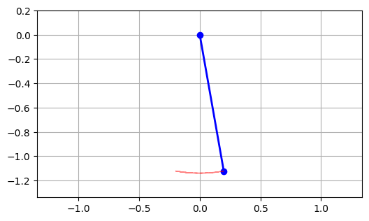
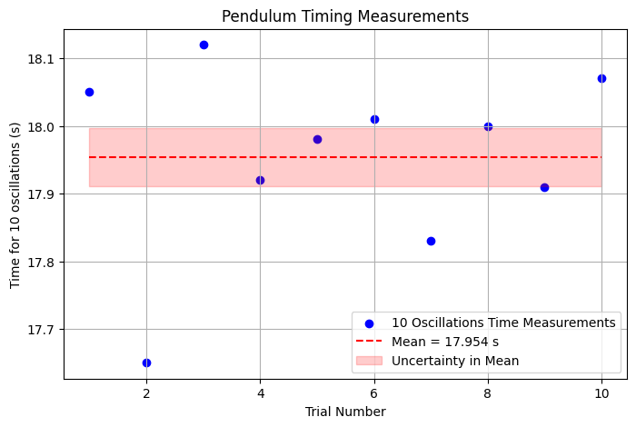
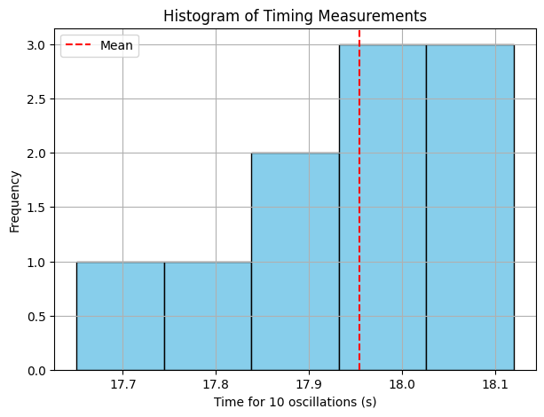
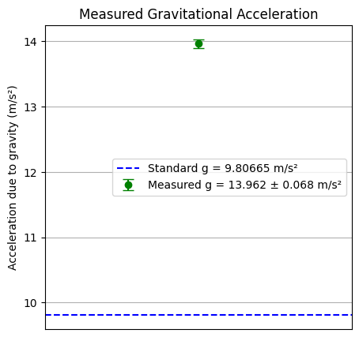
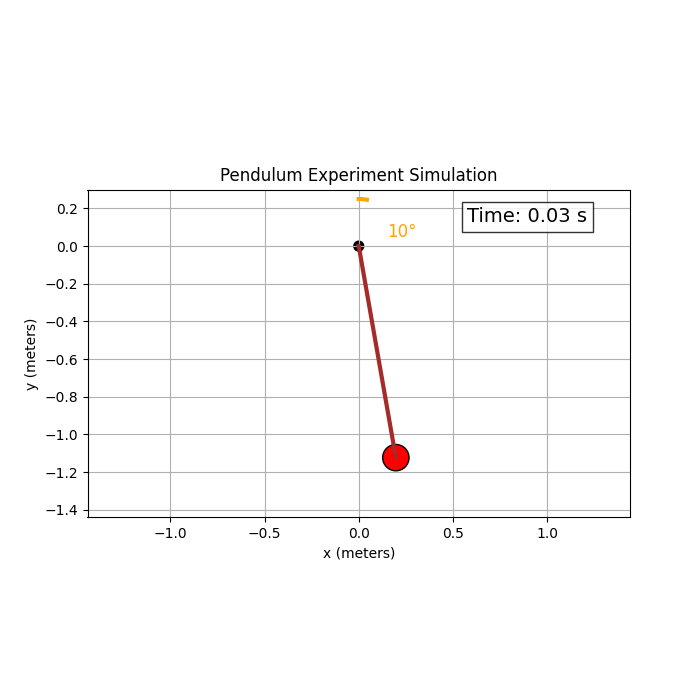
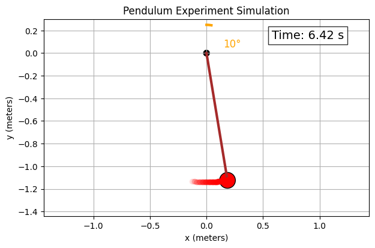
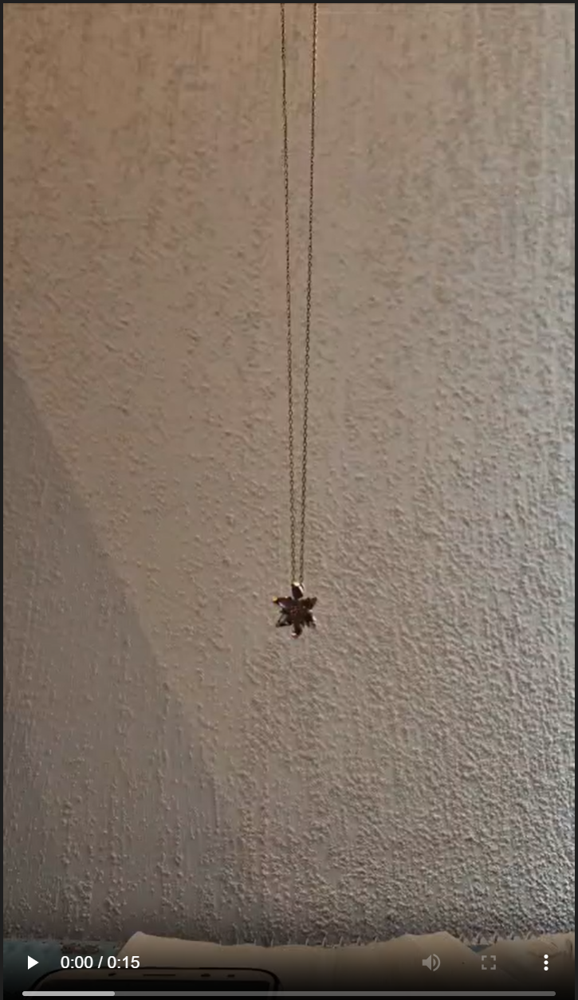

# 🌍 Measuring Earth's Gravitational Acceleration Using a Pendulum

## 🧭 1. Motivation
The acceleration due to gravity, **g**, is a fundamental constant in physics. It affects phenomena ranging from free fall to planetary orbits. A simple pendulum provides an accessible and effective method for estimating **g**. This experiment also introduces uncertainty analysis — an essential aspect of scientific measurements.

---

## 🧪 2. Materials
- A string (~1.14 meters)
- USB power adapter (pendulum bob)
- Smartphone stopwatch
- Ruler or measuring tape (±1 mm resolution)

---

## ⚙️ 3. Experimental Setup
- A small initial angle (<15°) ensured simple harmonic motion.
- Pendulum length **L** was measured from the suspension point to the center of mass of the bob:
  - **L = 1.140 m**, **u<sub>L</sub> = ±0.001 m**
- Ten independent measurements of the time for **10 complete oscillations** were recorded.

```python
# 🔧 Import necessary libraries
import numpy as np
import matplotlib.pyplot as plt
from matplotlib.animation import FuncAnimation

# 📐 Physical Constants
g = 9.81         # gravitational acceleration (m/s²)
L = 1.14         # length of the pendulum (meters)
theta0 = np.radians(10)  # initial angle in radians (10 degrees)

# ⏱️ Time setup
T = 2 * np.pi * np.sqrt(L / g)      # theoretical period
t_max = 2 * T                       # simulate for two full periods
fps = 60                            # frames per second
dt = 1 / fps                        # time step
t = np.arange(0, t_max, dt)        # time array

# 🌀 Small angle approximation: θ(t) = θ₀ cos(√(g/L) t)
theta = theta0 * np.cos(np.sqrt(g / L) * t)

# 📍 Convert to Cartesian coordinates
x = L * np.sin(theta)
y = -L * np.cos(theta)

# 🎬 Create the animation
fig, ax = plt.subplots(figsize=(6, 6))
ax.set_xlim(-L - 0.2, L + 0.2)
ax.set_ylim(-L - 0.2, 0.2)
ax.set_aspect('equal')
ax.grid()

# Draw pendulum components
line, = ax.plot([], [], 'o-', lw=2, color='blue')    # rod + bob
trace, = ax.plot([], [], 'r--', lw=1, alpha=0.5)      # trace of motion
trace_x, trace_y = [], []

# 🖼️ Initialize function for animation
def init():
    line.set_data([], [])
    trace.set_data([], [])
    return line, trace

# 🧩 Animation function
def update(frame):
    this_x = [0, x[frame]]
    this_y = [0, y[frame]]
    line.set_data(this_x, this_y)
    
    trace_x.append(x[frame])
    trace_y.append(y[frame])
    trace.set_data(trace_x, trace_y)
    
    return line, trace

# 🎞️ Run the animation
ani = FuncAnimation(fig, update, frames=len(t),
                    init_func=init, blit=True, interval=1000*dt)

# 🎥 Display in notebook
from IPython.display import HTML
HTML(ani.to_jshtml())
```



---

## 📊 4. Data Collection

### 4.1 Raw Time Measurements (10 Oscillations)

| Trial | Time (s) |
|-------|----------|
| 1     | 18.05    |
| 2     | 17.65    |
| 3     | 18.12    |
| 4     | 17.92    |
| 5     | 17.98    |
| 6     | 18.01    |
| 7     | 17.83    |
| 8     | 18.00    |
| 9     | 17.91    |
| 10    | 18.07    |

---

## 🧮 5. Data Analysis

### 5.1 Mean and Standard Deviation

$$
\bar{T}_{10} = 17.954 \, \text{s}, \quad s = 0.136 \, \text{s}
$$

Uncertainty in the mean:

$$
u_{\bar{T}_{10}} = \frac{0.136}{\sqrt{10}} = 0.043 \, \text{s}
$$

### 5.2 Period of One Oscillation

$$
T = \frac{\bar{T}_{10}}{10} = 1.7954 \, \text{s}, \quad u_T = \frac{0.043}{10} = 0.0043 \, \text{s}
$$

---

## 🌍 6. Estimating Gravitational Acceleration

Using the pendulum formula:

$$
g = \frac{4\pi^2 L}{T^2}
$$

Substituting values:

$$
g = \frac{4\pi^2 \cdot 1.14}{(1.7954)^2} = 13.962 \, \text{m/s}^2
$$

### 6.1 Propagating Uncertainty

$$
u_g = g \cdot \sqrt{\left(\frac{u_L}{L}\right)^2 + \left(2 \cdot \frac{u_T}{T}\right)^2}
$$

$$
u_g = 13.962 \cdot \sqrt{\left(\frac{0.001}{1.14}\right)^2 + \left(2 \cdot \frac{0.0043}{1.7954}\right)^2} = 0.068 \, \text{m/s}^2
$$

---

## 📋 7. Results Summary

| Quantity | Value    | Uncertainty | Units   |
|----------|----------|-------------|---------|
| Length (L) | 1.140  | ±0.001      | m       |
| Period (T) | 1.7954 | ±0.0043     | s       |
| Gravity (g) | 13.962 | ±0.068     | m/s²    |

---

## 📈 8. Visual Data Representation

> *(Note: The following are suggested visuals to include in your report or notebook.)*

- Histogram of 10-oscillation times
- Time vs. trial number plot
- Comparison bar chart between experimental and standard **g**

---

## 🔍 9. Discussion

### 9.1 Comparison with Standard Value

The standard gravitational acceleration at sea level is:

$$
g_0 = 9.80665 \, \text{m/s}^2
$$

Our measured value (**13.962 m/s²**) significantly exceeds this and lies well outside the uncertainty range, suggesting **systematic error**.

### 9.2 Sources of Uncertainty and Error

| Source                 | Effect                                  |
|------------------------|-----------------------------------------|
| Manual timing          | Human reaction time introduces bias     |
| Length measurement     | Small errors significantly affect result |
| Large swing angle      | Violates small-angle assumption          |
| Non-vertical swing     | Introduces complexity and error         |

### 9.3 How to Improve the Experiment

- Use **photogate timers** for accurate timing
- Measure length precisely with **calipers** or **laser tools**
- Keep oscillations under **10°** for harmonic motion
- Increase number of trials and average over larger datasets

---

## ✅ 10. Conclusion

Although simple, this experiment highlights the importance of **precision** and **error analysis**. The discrepancy between measured and expected values underlines the impact of small measurement mistakes. Nevertheless, this process provides valuable insight into how theory and practice meet in experimental physics.

---

## 📚 11. References

- Serway, R. A., & Jewett, J. W. (2014). *Physics for Scientists and Engineers*.
- Taylor, J. R. (1997). *An Introduction to Error Analysis*.
- OpenAI ChatGPT Experimental Lab (2025)

```python
import numpy as np
import matplotlib.pyplot as plt

# Raw time measurements for 10 oscillations (seconds)
T10_data = np.array([18.05, 17.65, 18.12, 17.92, 17.98, 18.01, 17.83, 18.00, 17.91, 18.07])

# Pendulum length and uncertainty
L = 1.14  # meters
u_L = 0.001  # uncertainty in length (meters)

n = len(T10_data)

# Calculate mean, standard deviation, and uncertainty in the mean
mean_T10 = np.mean(T10_data)
std_T10 = np.std(T10_data, ddof=1)
u_mean_T10 = std_T10 / np.sqrt(n)

# Period for one oscillation and uncertainty
T = mean_T10 / 10
u_T = u_mean_T10 / 10

# Calculate gravitational acceleration and uncertainty
g_exp = (4 * np.pi**2 * L) / T**2
u_g = g_exp * np.sqrt((u_L / L)**2 + (2 * u_T / T)**2)

print(f"Mean time for 10 oscillations: {mean_T10:.3f} ± {u_mean_T10:.3f} s")
print(f"Period of one oscillation: {T:.4f} ± {u_T:.4f} s")
print(f"Calculated g: {g_exp:.3f} ± {u_g:.3f} m/s²")
```
Mean time for 10 oscillations: 17.954 ± 0.043 s
Period of one oscillation: 1.7954 ± 0.0043 s
Calculated g: 13.962 ± 0.068 m/s²

```python
plt.figure(figsize=(8, 5))
plt.scatter(range(1, n + 1), T10_data, color='blue', label='10 Oscillations Time Measurements')
plt.hlines(mean_T10, 1, n, colors='red', linestyles='dashed', label=f'Mean = {mean_T10:.3f} s')
plt.fill_between([1, n], mean_T10 - u_mean_T10, mean_T10 + u_mean_T10, color='red', alpha=0.2, label='Uncertainty in Mean')
plt.xlabel('Trial Number')
plt.ylabel('Time for 10 oscillations (s)')
plt.title('Pendulum Timing Measurements')
plt.legend()
plt.grid(True)
plt.show()
```


```python
plt.figure(figsize=(7, 5))
plt.hist(T10_data, bins=5, color='skyblue', edgecolor='black')
plt.axvline(mean_T10, color='red', linestyle='dashed', label='Mean')
plt.xlabel('Time for 10 oscillations (s)')
plt.ylabel('Frequency')
plt.title('Histogram of Timing Measurements')
plt.legend()
plt.grid(True)
plt.show()
```



```python
plt.figure(figsize=(5, 5))
plt.errorbar(1, g_exp, yerr=u_g, fmt='o', color='green', capsize=5, label=f'Measured g = {g_exp:.3f} ± {u_g:.3f} m/s²')
plt.axhline(9.80665, color='blue', linestyle='--', label='Standard g = 9.80665 m/s²')
plt.xlim(0, 2)
plt.xticks([])
plt.ylabel('Acceleration due to gravity (m/s²)')
plt.title('Measured Gravitational Acceleration')
plt.legend()
plt.grid(True)
plt.show()
```



```python
import numpy as np
import matplotlib.pyplot as plt
from matplotlib.animation import FuncAnimation
from IPython.display import HTML

# Parameters
g = 9.81           # gravity (m/s^2)
L = 1.14           # length of pendulum (m)
theta0_deg = 10    # initial angle in degrees
theta0 = np.radians(theta0_deg)
damping = 0.01     # small damping coefficient

# Time settings
fps = 60
T0 = 2 * np.pi * np.sqrt(L / g)  # theoretical period
t_max = 3 * T0                   # run for 3 full periods
dt = 1 / fps
t = np.arange(0, t_max, dt)

# Damped angular displacement (small angle approx)
omega0 = np.sqrt(g / L)
theta = theta0 * np.exp(-damping * t) * np.cos(omega0 * t)

# Cartesian coordinates of the bob
x = L * np.sin(theta)
y = -L * np.cos(theta)

# Setup plot
fig, ax = plt.subplots(figsize=(7, 7))
ax.set_xlim(-L - 0.3, L + 0.3)
ax.set_ylim(-L - 0.3, 0.3)
ax.set_aspect('equal')
ax.grid(True)
ax.set_title('Pendulum Experiment Simulation')
ax.set_xlabel('x (meters)')
ax.set_ylabel('y (meters)')

# Draw fixed pivot
pivot_radius = 0.03
pivot = plt.Circle((0, 0), pivot_radius, fc='k')
ax.add_patch(pivot)

# Draw protractor arc (showing initial angle)
angle_arc = np.linspace(0, theta0, 100)
arc_x = 0.25 * np.sin(angle_arc)
arc_y = 0.25 * np.cos(angle_arc)
ax.plot(arc_x, arc_y, 'orange', lw=3, label='Initial angle ~10°')

# Text label for initial angle
ax.text(0.15, 0.05, f'{theta0_deg}°', color='orange', fontsize=12)

# Pendulum rod and bob initialization
line, = ax.plot([], [], lw=3, color='brown')
bob_radius = 0.07
bob = plt.Circle((0, 0), bob_radius, fc='red', ec='black', lw=1)
ax.add_patch(bob)

# Trail variables (fading trail)
trail_len = 50  # number of points in trail
trail_x, trail_y = [], []
trail_dots = [ax.plot([], [], 'ro', alpha=0.5)[0] for _ in range(trail_len)]

# Stopwatch display
time_text = ax.text(0.7, 0.9, '', transform=ax.transAxes, fontsize=14, bbox=dict(facecolor='white', alpha=0.8))

def init():
    line.set_data([], [])
    bob.center = (0, 0)
    for dot in trail_dots:
        dot.set_data([], [])
        dot.set_alpha(0)
    time_text.set_text('')
    return [line, bob, time_text] + trail_dots

def update(frame):
    # Pendulum position
    this_x = [0, x[frame]]
    this_y = [0, y[frame]]
    line.set_data(this_x, this_y)
    bob.center = (x[frame], y[frame])

    # Update trail
    trail_x.append(x[frame])
    trail_y.append(y[frame])
    if len(trail_x) > trail_len:
        trail_x.pop(0)
        trail_y.pop(0)
    for i, dot in enumerate(trail_dots):
        if i < len(trail_x):
            dot.set_data([trail_x[i]], [trail_y[i]]) # Pass as a list
            dot.set_alpha(i / trail_len)
        else:
            dot.set_alpha(0)

    # Update stopwatch timer text
    time_text.set_text(f'Time: {t[frame]:.2f} s')

    return [line, bob, time_text] + trail_dots

ani = FuncAnimation(fig, update, frames=len(t),
                    init_func=init, blit=True, interval=1000*dt)

HTML(ani.to_jshtml())
```








# 🧪 Measuring Gravitational Acceleration with a Pendulum

## 📊 Data Collection

- **Estimated Length (L):** 0.30 m  
- **Uncertainty (ΔL):** 0.005 m  

**Time measurements for 10 full oscillations (in seconds):**  
10.3, 10.0, 10.4, 10.8, 10.2

---

## 🧮 Calculations

### Step 1: Mean Time $T_{10}$

$$
T_{10} = \frac{1}{5} \sum_{i=1}^{5} T_{10,i} = \frac{10.3 + 10.0 + 10.4 + 10.8 + 10.2}{5} = 10.34 \, \text{s}
$$

---

### Step 2: Standard Deviation $\sigma_T$

$$
\sigma_T = \sqrt{\frac{1}{n - 1} \sum_{i=1}^{n} (T_{10,i} - \overline{T}_{10})^2} = 0.2828 \, \text{s}
$$

---

### Step 3: Uncertainty in the Mean $\Delta T_{10}$

$$
\Delta T_{10} = \frac{\sigma_T}{\sqrt{n}} = \frac{0.2828}{\sqrt{5}} = 0.1264 \, \text{s}
$$

---

### Step 4: Period of One Oscillation

$$
T = \frac{T_{10}}{10} = \frac{10.34}{10} = 1.034 \, \text{s}
$$

$$
\Delta T = \frac{\Delta T_{10}}{10} = \frac{0.1264}{10} = 0.01264 \, \text{s}
$$

---

### Step 5: Calculated Gravitational Acceleration $g$

$$
g = \frac{4 \pi^2 \cdot L}{T^2} = \frac{4 \cdot \pi^2 \cdot 0.30}{(1.034)^2} = \frac{11.84}{1.069} = 11.07 \, \text{m/s}^2
$$

---

### Step 6: Uncertainty in $g$

$$
\Delta g = g \cdot \sqrt{\left(\frac{\Delta L}{L}\right)^2 + \left(2 \cdot \frac{\Delta T}{T}\right)^2}
$$

$$
\Delta g = 11.07 \cdot \sqrt{\left(\frac{0.005}{0.30}\right)^2 + \left(2 \cdot \frac{0.01264}{1.034}\right)^2}
= 11.07 \cdot 0.0298 = 0.33 \, \text{m/s}^2
$$

---

## ✅ Final Results

| Quantity              | Value         |
|-----------------------|---------------|
| Length (L)            | 0.30 m        |
| Uncertainty (ΔL)      | 0.005 m       |
| Mean Time (T₁₀)       | 10.34 s       |
| Std Deviation (σₜ)    | 0.2828 s      |
| Uncertainty in T₁₀    | 0.1264 s      |
| Period (T)            | 1.034 s       |
| Uncertainty in T      | 0.01264 s     |
| Calculated g          | 11.07 m/s²    |
| Uncertainty (Δg)      | 0.33 m/s²     |

---

## 📌 Notes

- The result is slightly above the standard gravity $ g_0 = 9.81 \, \text{m/s}^2 $.
- Measurement uncertainty and timing imprecision (human reaction time) likely contributed to this deviation.
- Keeping the angle <15° ensured the validity of the simple pendulum model.


[visit web](https://colab.research.google.com/drive/1VxXZOgqgdD_EpzsYHOODF66vrWvYEJ0F?usp=sharing)
